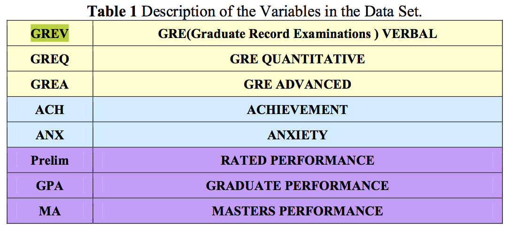

## Some Helpful Tips on R Notebooks

Try executing this chunk by clicking the *Run* button within the chunk or by placing your cursor inside it and pressing *Cmd+Shift+Enter*. 

Add a new chunk by clicking the *Insert Chunk* button on the toolbar or by pressing *Cmd+Option+I*.

When you save the notebook, an HTML file containing the code and output will be saved alongside it (click the *Preview* button or press *Cmd+Shift+K* to preview the HTML file). 

## Load and Describe the Data

```{r}
library(psych)
datafilename<- "http://personality-project.org/r/datasets/psychometrics.prob2.txt"
dataset <- read.table(datafilename, header=TRUE)
describe(dataset)
```

#

## GRE Verbal vs Quantitative

```{r}
plot(dataset$GREV ~ dataset$GREQ, xlim=c(191.0, 914.0), ylim=c(138.0, 873.0), xlab="gre quant", ylab="gre verbal")
```

## Correlation Matrix of All Variables

```{r}
round(cor(dataset, use="pairwise"),2)  # cor from stats, lowerCor(dataset) from psycho would give same thing
```

## Scatter Plot of All Variables

```{r}
pairs.panels(dataset[-1], pch=".", gap=0)
```

## Multiple Regression of GREV and GREQ predicting MA

```{r}
fit1 <- lm(MA ~ GREV + GREQ, data = dataset)
summary(fit1)
```

## Multiple R with GREV, GREQ, GREA
```{r}
fit2 <- lm(MA ~ GREV + GREQ + GREA, data = dataset)
summary(fit2)
```

## Compare these two models

```{r}
anova(fit1, fit2)
```

## Multiple Dependent Variables

```{r}
R <- lowerCor(dataset[-1])
set.cor(x=1:5, y=6:8, data = R)
```

