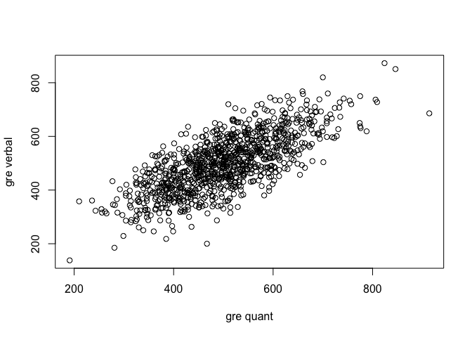

psychometrics hw2
================
Ryan Louie
2018-04-09

Some Helpful Tips on R Notebooks
--------------------------------

Try executing this chunk by clicking the *Run* button within the chunk or by placing your cursor inside it and pressing *Cmd+Shift+Enter*.

Add a new chunk by clicking the *Insert Chunk* button on the toolbar or by pressing *Cmd+Option+I*.

When you save the notebook, an HTML file containing the code and output will be saved alongside it (click the *Preview* button or press *Cmd+Shift+K* to preview the HTML file).

Load and Describe the Data
--------------------------

``` r
library(psych)
datafilename<- "http://personality-project.org/r/datasets/psychometrics.prob2.txt"
dataset <- read.table(datafilename, header=TRUE)
describe(dataset)
```

    ##        vars    n   mean     sd median trimmed    mad   min     max  range
    ## ID        1 1000 500.50 288.82 500.50  500.50 370.65   1.0 1000.00 999.00
    ## GREV      2 1000 499.77 106.11 497.50  498.75 106.01 138.0  873.00 735.00
    ## GREQ      3 1000 500.53 103.85 498.00  498.51 105.26 191.0  914.00 723.00
    ## GREA      4 1000 498.13 100.45 495.00  498.67  99.33 207.0  848.00 641.00
    ## Ach       5 1000  49.93   9.84  50.00   49.88  10.38  16.0   79.00  63.00
    ## Anx       6 1000  50.32   9.91  50.00   50.43  10.38  14.0   78.00  64.00
    ## Prelim    7 1000  10.03   1.06  10.00   10.02   1.48   7.0   13.00   6.00
    ## GPA       8 1000   4.00   0.50   4.02    4.01   0.53   2.5    5.38   2.88
    ## MA        9 1000   3.00   0.49   3.00    3.00   0.44   1.4    4.50   3.10
    ##         skew kurtosis   se
    ## ID      0.00    -1.20 9.13
    ## GREV    0.09    -0.07 3.36
    ## GREQ    0.22     0.08 3.28
    ## GREA   -0.02    -0.06 3.18
    ## Ach     0.00     0.02 0.31
    ## Anx    -0.14     0.14 0.31
    ## Prelim -0.02    -0.01 0.03
    ## GPA    -0.07    -0.29 0.02
    ## MA     -0.07    -0.09 0.02


=============================================

GRE Verbal vs Quantitative
--------------------------

``` r
plot(dataset$GREV ~ dataset$GREQ, xlim=c(191.0, 914.0), ylim=c(138.0, 873.0), xlab="gre quant", ylab="gre verbal")
```



Correlation Matrix of All Variables
-----------------------------------

``` r
round(cor(dataset, use="pairwise"),2)  # cor from stats, lowerCor(dataset) from psycho would give same thing
```

    ##           ID  GREV GREQ  GREA   Ach   Anx Prelim   GPA    MA
    ## ID      1.00 -0.01 0.00 -0.01  0.00 -0.01   0.02  0.00 -0.01
    ## GREV   -0.01  1.00 0.73  0.64  0.01  0.01   0.43  0.42  0.32
    ## GREQ    0.00  0.73 1.00  0.60  0.01  0.01   0.38  0.37  0.29
    ## GREA   -0.01  0.64 0.60  1.00  0.45 -0.39   0.57  0.52  0.45
    ## Ach     0.00  0.01 0.01  0.45  1.00 -0.56   0.30  0.28  0.26
    ## Anx    -0.01  0.01 0.01 -0.39 -0.56  1.00  -0.23 -0.22 -0.22
    ## Prelim  0.02  0.43 0.38  0.57  0.30 -0.23   1.00  0.42  0.36
    ## GPA     0.00  0.42 0.37  0.52  0.28 -0.22   0.42  1.00  0.31
    ## MA     -0.01  0.32 0.29  0.45  0.26 -0.22   0.36  0.31  1.00

Scatter Plot of All Variables
-----------------------------

``` r
pairs.panels(dataset[-1], pch=".", gap=0)
```


Multiple Regression of GREV and GREQ predicting MA
--------------------------------------------------

``` r
fit1 <- lm(MA ~ GREV + GREQ, data = dataset)
summary(fit1)
```

    ## 
    ## Call:
    ## lm(formula = MA ~ GREV + GREQ, data = dataset)
    ## 
    ## Residuals:
    ##      Min       1Q   Median       3Q      Max 
    ## -1.47912 -0.31272  0.01348  0.31216  1.41784 
    ## 
    ## Coefficients:
    ##              Estimate Std. Error t value Pr(>|t|)    
    ## (Intercept) 2.1690912  0.0771484  28.116  < 2e-16 ***
    ## GREV        0.0011211  0.0002033   5.515 4.44e-08 ***
    ## GREQ        0.0005328  0.0002077   2.565   0.0105 *  
    ## ---
    ## Signif. codes:  0 '***' 0.001 '**' 0.01 '*' 0.05 '.' 0.1 ' ' 1
    ## 
    ## Residual standard error: 0.4668 on 997 degrees of freedom
    ## Multiple R-squared:  0.1098, Adjusted R-squared:  0.108 
    ## F-statistic: 61.46 on 2 and 997 DF,  p-value: < 2.2e-16

Multiple R with GREV, GREQ, GREA
--------------------------------

``` r
fit2 <- lm(MA ~ GREV + GREQ + GREA, data = dataset)
summary(fit2)
```

    ## 
    ## Call:
    ## lm(formula = MA ~ GREV + GREQ + GREA, data = dataset)
    ## 
    ## Residuals:
    ##      Min       1Q   Median       3Q      Max 
    ## -1.37779 -0.29802  0.01818  0.30276  1.38537 
    ## 
    ## Coefficients:
    ##               Estimate Std. Error t value Pr(>|t|)    
    ## (Intercept)  1.844e+00  7.842e-02  23.518   <2e-16 ***
    ## GREV         2.555e-04  2.070e-04   1.235    0.217    
    ## GREQ        -1.986e-05  2.022e-04  -0.098    0.922    
    ## GREA         2.076e-03  1.865e-04  11.131   <2e-16 ***
    ## ---
    ## Signif. codes:  0 '***' 0.001 '**' 0.01 '*' 0.05 '.' 0.1 ' ' 1
    ## 
    ## Residual standard error: 0.4404 on 996 degrees of freedom
    ## Multiple R-squared:  0.2082, Adjusted R-squared:  0.2059 
    ## F-statistic: 87.32 on 3 and 996 DF,  p-value: < 2.2e-16

Compare these two models
------------------------

``` r
anova(fit1, fit2)
```

    ## Analysis of Variance Table
    ## 
    ## Model 1: MA ~ GREV + GREQ
    ## Model 2: MA ~ GREV + GREQ + GREA
    ##   Res.Df    RSS Df Sum of Sq      F    Pr(>F)    
    ## 1    997 217.25                                  
    ## 2    996 193.22  1    24.035 123.89 < 2.2e-16 ***
    ## ---
    ## Signif. codes:  0 '***' 0.001 '**' 0.01 '*' 0.05 '.' 0.1 ' ' 1

Multiple Dependent Variables
----------------------------

``` r
R <- lowerCor(dataset[-1])
```

    ##        GREV  GREQ  GREA  Ach   Anx   Prelm GPA   MA   
    ## GREV    1.00                                          
    ## GREQ    0.73  1.00                                    
    ## GREA    0.64  0.60  1.00                              
    ## Ach     0.01  0.01  0.45  1.00                        
    ## Anx     0.01  0.01 -0.39 -0.56  1.00                  
    ## Prelim  0.43  0.38  0.57  0.30 -0.23  1.00            
    ## GPA     0.42  0.37  0.52  0.28 -0.22  0.42  1.00      
    ## MA      0.32  0.29  0.45  0.26 -0.22  0.36  0.31  1.00

``` r
set.cor(x=1:5, y=6:8, data = R)
```


    ## Call: setCor(y = y, x = x, data = data, z = z, n.obs = n.obs, use = use, 
    ##     std = std, square = square, main = main, plot = plot, show = show)
    ## 
    ## Multiple Regression from matrix input 
    ## 
    ##  DV =  Prelim 
    ##      slope  VIF
    ## GREV  0.14 2.74
    ## GREQ  0.04 2.36
    ## GREA  0.40 3.12
    ## Ach   0.11 1.79
    ## Anx  -0.01 1.59
    ## 
    ##  Multiple Regression
    ##           R   R2  Ruw R2uw
    ## Prelim 0.59 0.34 0.56 0.31
    ## 
    ##  DV =  GPA 
    ##      slope  VIF
    ## GREV  0.20 2.74
    ## GREQ  0.05 2.36
    ## GREA  0.29 3.12
    ## Ach   0.12 1.79
    ## Anx  -0.05 1.59
    ## 
    ##  Multiple Regression
    ##        R   R2  Ruw R2uw
    ## GPA 0.54 0.29 0.53 0.28
    ## 
    ##  DV =  MA 
    ##      slope  VIF
    ## GREV  0.10 2.74
    ## GREQ  0.03 2.36
    ## GREA  0.31 3.12
    ## Ach   0.10 1.79
    ## Anx  -0.05 1.59
    ## 
    ##  Multiple Regression
    ##       R   R2  Ruw R2uw
    ## MA 0.47 0.22 0.45  0.2
    ## 
    ## Various estimates of between set correlations
    ## Squared Canonical Correlations 
    ## [1] 0.4943 0.0036 0.0017
    ## 
    ##  Average squared canonical correlation =  0.17
    ##  Cohen's Set Correlation R2 =  0.5
    ## Unweighted correlation between the two sets =  0.68
