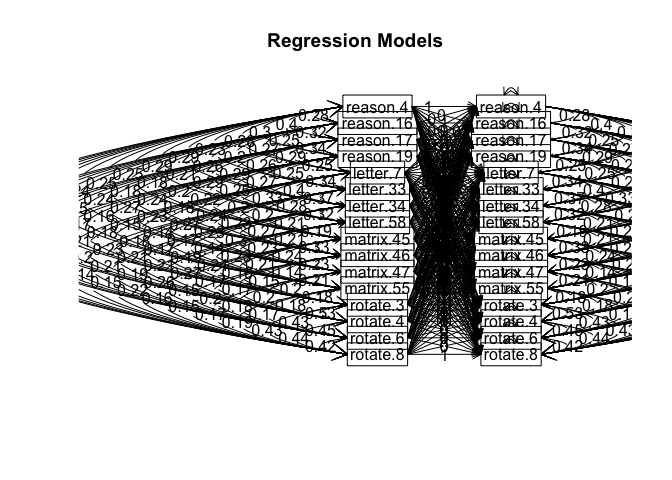

psychometrics hw4 factor analysis
================
Ryan Louie
2018-04-30

Some Helpful Tips on R Notebooks
--------------------------------

Try executing this chunk by clicking the *Run* button within the chunk or by placing your cursor inside it and pressing *Cmd+Shift+Enter*.

Add a new chunk by clicking the *Insert Chunk* button on the toolbar or by pressing *Cmd+Option+I*.

When you save the notebook, an HTML file containing the code and output will be saved alongside it (click the *Preview* button or press *Cmd+Shift+K* to preview the HTML file).

Load and Describe the Data
--------------------------

``` r
library(psych)
datafilename<- "datasets/ability.txt"
dataset <- read.table(datafilename, header=TRUE)
describe(dataset)
```

    ##           vars    n mean   sd median trimmed mad min max range  skew
    ## reason.4     1 1442 0.68 0.47      1    0.72   0   0   1     1 -0.75
    ## reason.16    2 1463 0.73 0.45      1    0.78   0   0   1     1 -1.02
    ## reason.17    3 1440 0.74 0.44      1    0.80   0   0   1     1 -1.08
    ## reason.19    4 1456 0.64 0.48      1    0.68   0   0   1     1 -0.60
    ## letter.7     5 1441 0.63 0.48      1    0.67   0   0   1     1 -0.56
    ## letter.33    6 1438 0.61 0.49      1    0.63   0   0   1     1 -0.43
    ## letter.34    7 1455 0.64 0.48      1    0.68   0   0   1     1 -0.59
    ## letter.58    8 1438 0.47 0.50      0    0.46   0   0   1     1  0.12
    ## matrix.45    9 1458 0.55 0.50      1    0.56   0   0   1     1 -0.20
    ## matrix.46   10 1470 0.57 0.50      1    0.59   0   0   1     1 -0.28
    ## matrix.47   11 1465 0.64 0.48      1    0.67   0   0   1     1 -0.57
    ## matrix.55   12 1459 0.39 0.49      0    0.36   0   0   1     1  0.45
    ## rotate.3    13 1456 0.20 0.40      0    0.13   0   0   1     1  1.48
    ## rotate.4    14 1460 0.22 0.42      0    0.15   0   0   1     1  1.34
    ## rotate.6    15 1456 0.31 0.46      0    0.27   0   0   1     1  0.80
    ## rotate.8    16 1460 0.19 0.39      0    0.12   0   0   1     1  1.55
    ##           kurtosis   se
    ## reason.4     -1.44 0.01
    ## reason.16    -0.96 0.01
    ## reason.17    -0.84 0.01
    ## reason.19    -1.64 0.01
    ## letter.7     -1.69 0.01
    ## letter.33    -1.82 0.01
    ## letter.34    -1.65 0.01
    ## letter.58    -1.99 0.01
    ## matrix.45    -1.96 0.01
    ## matrix.46    -1.92 0.01
    ## matrix.47    -1.67 0.01
    ## matrix.55    -1.80 0.01
    ## rotate.3      0.19 0.01
    ## rotate.4     -0.21 0.01
    ## rotate.6     -1.35 0.01
    ## rotate.8      0.41 0.01

Correlations
------------

``` r
R <- lowerCor(dataset)
```

    ##           rsn.4 rs.16 rs.17 rs.19 ltt.7 lt.33 lt.34 lt.58 mt.45 mt.46
    ## reason.4  1.00                                                       
    ## reason.16 0.28  1.00                                                 
    ## reason.17 0.40  0.32  1.00                                           
    ## reason.19 0.30  0.25  0.34  1.00                                     
    ## letter.7  0.28  0.27  0.29  0.25  1.00                               
    ## letter.33 0.23  0.20  0.26  0.25  0.34  1.00                         
    ## letter.34 0.29  0.26  0.29  0.27  0.40  0.37  1.00                   
    ## letter.58 0.29  0.21  0.29  0.25  0.33  0.28  0.32  1.00             
    ## matrix.45 0.25  0.18  0.20  0.22  0.20  0.20  0.21  0.19  1.00       
    ## matrix.46 0.25  0.18  0.24  0.18  0.24  0.23  0.27  0.21  0.33  1.00 
    ## matrix.47 0.24  0.24  0.27  0.23  0.27  0.23  0.30  0.23  0.24  0.23 
    ## matrix.55 0.16  0.15  0.16  0.15  0.14  0.17  0.14  0.23  0.21  0.14 
    ## rotate.3  0.23  0.16  0.17  0.18  0.18  0.17  0.19  0.24  0.16  0.15 
    ## rotate.4  0.25  0.20  0.20  0.21  0.23  0.21  0.21  0.27  0.17  0.17 
    ## rotate.6  0.25  0.20  0.27  0.19  0.20  0.21  0.19  0.26  0.15  0.20 
    ## rotate.8  0.21  0.16  0.18  0.16  0.13  0.14  0.15  0.22  0.16  0.15 
    ##           mt.47 mt.55 rtt.3 rtt.4 rtt.6 rtt.8
    ## matrix.47 1.00                               
    ## matrix.55 0.21  1.00                         
    ## rotate.3  0.20  0.18  1.00                   
    ## rotate.4  0.20  0.18  0.53  1.00             
    ## rotate.6  0.18  0.17  0.43  0.45  1.00       
    ## rotate.8  0.17  0.19  0.43  0.44  0.42  1.00

``` r
set.cor(x=1:16, y=1:16, data = R)
```



    ## Call: setCor(y = y, x = x, data = data, z = z, n.obs = n.obs, use = use, 
    ##     std = std, square = square, main = main, plot = plot, show = show)
    ## 
    ## Multiple Regression from matrix input 
    ## 
    ##  DV =  reason.4 
    ##           slope  VIF
    ## reason.4      1 1.38
    ## reason.16     0 1.23
    ## reason.17     0 1.41
    ## reason.19     0 1.26
    ## letter.7      0 1.39
    ## letter.33     0 1.30
    ## letter.34     0 1.42
    ## letter.58     0 1.32
    ## matrix.45     0 1.23
    ## matrix.46     0 1.24
    ## matrix.47     0 1.25
    ## matrix.55     0 1.14
    ## rotate.3      0 1.58
    ## rotate.4      0 1.65
    ## rotate.6      0 1.49
    ## rotate.8      0 1.43
    ## 
    ##  Multiple Regression
    ##          R R2  Ruw R2uw
    ## reason.4 1  1 0.58 0.34
    ## 
    ##  DV =  reason.16 
    ##           slope  VIF
    ## reason.4      0 1.38
    ## reason.16     1 1.23
    ## reason.17     0 1.41
    ## reason.19     0 1.26
    ## letter.7      0 1.39
    ## letter.33     0 1.30
    ## letter.34     0 1.42
    ## letter.58     0 1.32
    ## matrix.45     0 1.23
    ## matrix.46     0 1.24
    ## matrix.47     0 1.25
    ## matrix.55     0 1.14
    ## rotate.3      0 1.58
    ## rotate.4      0 1.65
    ## rotate.6      0 1.49
    ## rotate.8      0 1.43
    ## 
    ##  Multiple Regression
    ##           R R2 Ruw R2uw
    ## reason.16 1  1 0.5 0.25
    ## 
    ##  DV =  reason.17 
    ##           slope  VIF
    ## reason.4      0 1.38
    ## reason.16     0 1.23
    ## reason.17     1 1.41
    ## reason.19     0 1.26
    ## letter.7      0 1.39
    ## letter.33     0 1.30
    ## letter.34     0 1.42
    ## letter.58     0 1.32
    ## matrix.45     0 1.23
    ## matrix.46     0 1.24
    ## matrix.47     0 1.25
    ## matrix.55     0 1.14
    ## rotate.3      0 1.58
    ## rotate.4      0 1.65
    ## rotate.6      0 1.49
    ## rotate.8      0 1.43
    ## 
    ##  Multiple Regression
    ##           R R2  Ruw R2uw
    ## reason.17 1  1 0.57 0.33
    ## 
    ##  DV =  reason.19 
    ##           slope  VIF
    ## reason.4      0 1.38
    ## reason.16     0 1.23
    ## reason.17     0 1.41
    ## reason.19     1 1.26
    ## letter.7      0 1.39
    ## letter.33     0 1.30
    ## letter.34     0 1.42
    ## letter.58     0 1.32
    ## matrix.45     0 1.23
    ## matrix.46     0 1.24
    ## matrix.47     0 1.25
    ## matrix.55     0 1.14
    ## rotate.3      0 1.58
    ## rotate.4      0 1.65
    ## rotate.6      0 1.49
    ## rotate.8      0 1.43
    ## 
    ##  Multiple Regression
    ##           R R2  Ruw R2uw
    ## reason.19 1  1 0.52 0.27
    ## 
    ##  DV =  letter.7 
    ##           slope  VIF
    ## reason.4      0 1.38
    ## reason.16     0 1.23
    ## reason.17     0 1.41
    ## reason.19     0 1.26
    ## letter.7      1 1.39
    ## letter.33     0 1.30
    ## letter.34     0 1.42
    ## letter.58     0 1.32
    ## matrix.45     0 1.23
    ## matrix.46     0 1.24
    ## matrix.47     0 1.25
    ## matrix.55     0 1.14
    ## rotate.3      0 1.58
    ## rotate.4      0 1.65
    ## rotate.6      0 1.49
    ## rotate.8      0 1.43
    ## 
    ##  Multiple Regression
    ##          R R2  Ruw R2uw
    ## letter.7 1  1 0.56 0.31
    ## 
    ##  DV =  letter.33 
    ##           slope  VIF
    ## reason.4      0 1.38
    ## reason.16     0 1.23
    ## reason.17     0 1.41
    ## reason.19     0 1.26
    ## letter.7      0 1.39
    ## letter.33     1 1.30
    ## letter.34     0 1.42
    ## letter.58     0 1.32
    ## matrix.45     0 1.23
    ## matrix.46     0 1.24
    ## matrix.47     0 1.25
    ## matrix.55     0 1.14
    ## rotate.3      0 1.58
    ## rotate.4      0 1.65
    ## rotate.6      0 1.49
    ## rotate.8      0 1.43
    ## 
    ##  Multiple Regression
    ##           R R2  Ruw R2uw
    ## letter.33 1  1 0.53 0.28
    ## 
    ##  DV =  letter.34 
    ##           slope  VIF
    ## reason.4      0 1.38
    ## reason.16     0 1.23
    ## reason.17     0 1.41
    ## reason.19     0 1.26
    ## letter.7      0 1.39
    ## letter.33     0 1.30
    ## letter.34     1 1.42
    ## letter.58     0 1.32
    ## matrix.45     0 1.23
    ## matrix.46     0 1.24
    ## matrix.47     0 1.25
    ## matrix.55     0 1.14
    ## rotate.3      0 1.58
    ## rotate.4      0 1.65
    ## rotate.6      0 1.49
    ## rotate.8      0 1.43
    ## 
    ##  Multiple Regression
    ##           R R2  Ruw R2uw
    ## letter.34 1  1 0.57 0.33
    ## 
    ##  DV =  letter.58 
    ##           slope  VIF
    ## reason.4      0 1.38
    ## reason.16     0 1.23
    ## reason.17     0 1.41
    ## reason.19     0 1.26
    ## letter.7      0 1.39
    ## letter.33     0 1.30
    ## letter.34     0 1.42
    ## letter.58     1 1.32
    ## matrix.45     0 1.23
    ## matrix.46     0 1.24
    ## matrix.47     0 1.25
    ## matrix.55     0 1.14
    ## rotate.3      0 1.58
    ## rotate.4      0 1.65
    ## rotate.6      0 1.49
    ## rotate.8      0 1.43
    ## 
    ##  Multiple Regression
    ##           R R2  Ruw R2uw
    ## letter.58 1  1 0.57 0.32
    ## 
    ##  DV =  matrix.45 
    ##           slope  VIF
    ## reason.4      0 1.38
    ## reason.16     0 1.23
    ## reason.17     0 1.41
    ## reason.19     0 1.26
    ## letter.7      0 1.39
    ## letter.33     0 1.30
    ## letter.34     0 1.42
    ## letter.58     0 1.32
    ## matrix.45     1 1.23
    ## matrix.46     0 1.24
    ## matrix.47     0 1.25
    ## matrix.55     0 1.14
    ## rotate.3      0 1.58
    ## rotate.4      0 1.65
    ## rotate.6      0 1.49
    ## rotate.8      0 1.43
    ## 
    ##  Multiple Regression
    ##           R R2  Ruw R2uw
    ## matrix.45 1  1 0.48 0.23
    ## 
    ##  DV =  matrix.46 
    ##           slope  VIF
    ## reason.4      0 1.38
    ## reason.16     0 1.23
    ## reason.17     0 1.41
    ## reason.19     0 1.26
    ## letter.7      0 1.39
    ## letter.33     0 1.30
    ## letter.34     0 1.42
    ## letter.58     0 1.32
    ## matrix.45     0 1.23
    ## matrix.46     1 1.24
    ## matrix.47     0 1.25
    ## matrix.55     0 1.14
    ## rotate.3      0 1.58
    ## rotate.4      0 1.65
    ## rotate.6      0 1.49
    ## rotate.8      0 1.43
    ## 
    ##  Multiple Regression
    ##           R R2  Ruw R2uw
    ## matrix.46 1  1 0.49 0.24
    ## 
    ##  DV =  matrix.47 
    ##           slope  VIF
    ## reason.4      0 1.38
    ## reason.16     0 1.23
    ## reason.17     0 1.41
    ## reason.19     0 1.26
    ## letter.7      0 1.39
    ## letter.33     0 1.30
    ## letter.34     0 1.42
    ## letter.58     0 1.32
    ## matrix.45     0 1.23
    ## matrix.46     0 1.24
    ## matrix.47     1 1.25
    ## matrix.55     0 1.14
    ## rotate.3      0 1.58
    ## rotate.4      0 1.65
    ## rotate.6      0 1.49
    ## rotate.8      0 1.43
    ## 
    ##  Multiple Regression
    ##           R R2  Ruw R2uw
    ## matrix.47 1  1 0.52 0.27
    ## 
    ##  DV =  matrix.55 
    ##           slope  VIF
    ## reason.4      0 1.38
    ## reason.16     0 1.23
    ## reason.17     0 1.41
    ## reason.19     0 1.26
    ## letter.7      0 1.39
    ## letter.33     0 1.30
    ## letter.34     0 1.42
    ## letter.58     0 1.32
    ## matrix.45     0 1.23
    ## matrix.46     0 1.24
    ## matrix.47     0 1.25
    ## matrix.55     1 1.14
    ## rotate.3      0 1.58
    ## rotate.4      0 1.65
    ## rotate.6      0 1.49
    ## rotate.8      0 1.43
    ## 
    ##  Multiple Regression
    ##           R R2  Ruw R2uw
    ## matrix.55 1  1 0.42 0.18
    ## 
    ##  DV =  rotate.3 
    ##           slope  VIF
    ## reason.4      0 1.38
    ## reason.16     0 1.23
    ## reason.17     0 1.41
    ## reason.19     0 1.26
    ## letter.7      0 1.39
    ## letter.33     0 1.30
    ## letter.34     0 1.42
    ## letter.58     0 1.32
    ## matrix.45     0 1.23
    ## matrix.46     0 1.24
    ## matrix.47     0 1.25
    ## matrix.55     0 1.14
    ## rotate.3      1 1.58
    ## rotate.4      0 1.65
    ## rotate.6      0 1.49
    ## rotate.8      0 1.43
    ## 
    ##  Multiple Regression
    ##          R R2  Ruw R2uw
    ## rotate.3 1  1 0.54 0.29
    ## 
    ##  DV =  rotate.4 
    ##           slope  VIF
    ## reason.4      0 1.38
    ## reason.16     0 1.23
    ## reason.17     0 1.41
    ## reason.19     0 1.26
    ## letter.7      0 1.39
    ## letter.33     0 1.30
    ## letter.34     0 1.42
    ## letter.58     0 1.32
    ## matrix.45     0 1.23
    ## matrix.46     0 1.24
    ## matrix.47     0 1.25
    ## matrix.55     0 1.14
    ## rotate.3      0 1.58
    ## rotate.4      1 1.65
    ## rotate.6      0 1.49
    ## rotate.8      0 1.43
    ## 
    ##  Multiple Regression
    ##          R R2  Ruw R2uw
    ## rotate.4 1  1 0.58 0.34
    ## 
    ##  DV =  rotate.6 
    ##           slope  VIF
    ## reason.4      0 1.38
    ## reason.16     0 1.23
    ## reason.17     0 1.41
    ## reason.19     0 1.26
    ## letter.7      0 1.39
    ## letter.33     0 1.30
    ## letter.34     0 1.42
    ## letter.58     0 1.32
    ## matrix.45     0 1.23
    ## matrix.46     0 1.24
    ## matrix.47     0 1.25
    ## matrix.55     0 1.14
    ## rotate.3      0 1.58
    ## rotate.4      0 1.65
    ## rotate.6      1 1.49
    ## rotate.8      0 1.43
    ## 
    ##  Multiple Regression
    ##          R R2  Ruw R2uw
    ## rotate.6 1  1 0.56 0.32
    ## 
    ##  DV =  rotate.8 
    ##           slope  VIF
    ## reason.4      0 1.38
    ## reason.16     0 1.23
    ## reason.17     0 1.41
    ## reason.19     0 1.26
    ## letter.7      0 1.39
    ## letter.33     0 1.30
    ## letter.34     0 1.42
    ## letter.58     0 1.32
    ## matrix.45     0 1.23
    ## matrix.46     0 1.24
    ## matrix.47     0 1.25
    ## matrix.55     0 1.14
    ## rotate.3      0 1.58
    ## rotate.4      0 1.65
    ## rotate.6      0 1.49
    ## rotate.8      1 1.43
    ## 
    ##  Multiple Regression
    ##          R R2  Ruw R2uw
    ## rotate.8 1  1 0.51 0.26
    ## 
    ## Various estimates of between set correlations
    ## Squared Canonical Correlations 
    ##  [1] 1 1 1 1 1 1 1 1 1 1 1 1 1 1 1 1
    ## 
    ##  Average squared canonical correlation =  1
    ##  Cohen's Set Correlation R2 =  1
    ## Unweighted correlation between the two sets =  1
